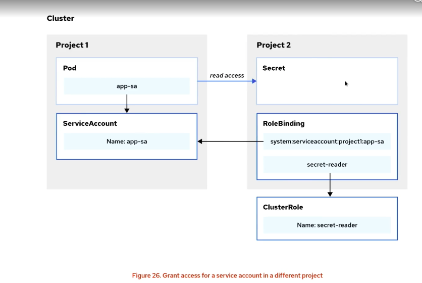

# OpenShift DO280 

> Configuring a Production Cluster (OpenShift/EX280).

## Inhaltsverzeichnis

- [1. Declarative Resource Management](#1-Declarative-Resource-Management)
- [2. Deploying Packaged Applications](#2-Deploying-Packaged-Applications)
- [3. Authentication and Authorization](#3-Authentication-and-Authorization)
- [4. Network Security](#4-network-security)
- [5. Exposing non-HTTP/SNI Applications](#5-exposing-non-httpsni-applications)
- [6. Enabling Developer Self-service (Resources and Quotas)](#6-Enabling-Developer-Self-service-Resources-and-Quotas)
- [7. Managing Kubernetes Operators](#7-Managing-Kubernetes-Operators)
- [8. Application Security](#8-Application-Security)
- [9. Openshift Updates](#9-Openshift-Updates)


---


# 1. Declarative Resource Management

```bash


```

---


# 2. Deploying Packaged Applications

```bash


```

# 3. Authentication and Authorization

## User Management

```bash
oc get oauth cluster \                                   # config identity provider lokal ablegen -> ändern
-o yaml > ~/DO280/labs/auth-providers/oauth.yaml
oc replace -f ~/DO280/labs/auth-providers/oauth.yaml     # geänderte config in CLuster hochladen
# htpasswd: CR oauth muss auch im Namespace openshift-authentication nach offizieller Doku angepasst werden!
# Workflow: htpasswd lokal generieren -> User hinzufügen -> Secret anlegen -> htpasswd lokal extrahieren/ändern -> secret ändern (über set data)
htpasswd -c -b -B ./file sascha passwrd                  # erstellt (neue) htpasswd file -B bcrypt very secure
htpasswd -D /tmp/htpasswd manager                        # User löschen (auch manuell in Datei möglich)
htpasswd -b ~/tmp/passwd manager redhat                  # User hinzufügen
htpasswd -n -b dba redhat                                # erstellt Hash -> nur Ausgabe Konsole zum Testen
oc create secret generic htpasswd-secret \               # erstellt secret aus htpasswd file
--from-file htpasswd=/tmp/htpasswd -n openshift-config   # key "passwd" ist wichtig, namespace auch
oc extract secret/htpasswd-secret -n openshift-config \  # Inhalt von htpasswd secret anzeigen/extrahieren
--to /tmp/ --confirm
oc set data secret/htpasswd-secret \                     # Secret updaten nach Änderung
--from-file htpasswd=/tmp/htpasswd -n openshift-config
watch oc get pods -n openshift-authentication            # jede oauth Änderung führt zum Neustarten der Oauth pods
oc delete user manager                                   # Ressourcen von User löschen -> aus Openshift löschen
oc get identities                                        # Identity aus Open-Shift auslesen[user@host ~]$ oc delete identity my_htpasswd_provider:manager
oc delete identity my_htpasswd_provider:manager          # identity löschen

oc adm policy add-cluster-role-to-user cluster-admin student # Clusterrechte einem User zuweisen
oc adm groups new developers                             # neue Gruppe erstellen
```
---

## RBAC

```bash
# RBAC
oc adm policy add-cluster-role-to-user {cluster-role} {username}       # Cluster-Role zu User hinzufügen
oc adm policy remove-cluster-role-from-user {cluster-role} {username}  # Cluster-Role von User löschen
oc adm policy who-can delete user                                      # Herausfinden ob user Befehl ausführen kann
oc policy add-role-to-user {role-name} {username} -n {namespace}       # Rolle zu User hinzufügen
```

---

# 4. Network Security

```bash
┌─────────────────────────────────────────────────────────────────────────────┐
│                         OpenShift Route-Typen                               │
└─────────────────────────────────────────────────────────────────────────────┘

1) Edge Route

           HTTPS                        HTTP
+--------+===========>+-------------+----------->+-----------+
| Client |            | OCP Router  |            |    Pod    |
+--------+            +-------------+            +-----------+
                           ▲
                           │
                    Router-Zertifikat
                     (tls.crt / tls.key)

TLS wird am Router beendet.
──────────────────────────────────────────────────────────────────────────────
2) Passthrough Route

                HTTPS (eine durchgehende TLS-Verbindung)

+--------+===============================================>+-----------+
| Client |                                                |    Pod    |
+--------+                                                +-----------+
                      │
                      ▼
                +-------------+
                | OCP Router  |
                +-------------+

                     Router schaut nur auf SNI
                     und leitet die Verbindung weiter.
                           ▲
                           │
                    Backend-Zertifikat
                     (Secret im Pod)

TLS wird erst im Pod beendet.

──────────────────────────────────────────────────────────────────────────────

3) Re-encrypt Route

         HTTPS                         HTTPS

+--------+===========>+-------------+===========>+-----------+
| Client |            | OCP Router  |            |    Pod    |
+--------+            +-------------+            +-----------+
                           ▲                         ▲
                           │                         │
                    Router-Zertifikat        Backend-Zertifikat

             TLS #1 endet hier       TLS #2 beginnt hier

Der Router entschlüsselt den Traffic und baut anschließend
eine neue TLS-Verbindung zum Backend auf.

https://www.redhat.com/architect/encryption-secure-routes-openshift
# Befehle zum Erstellen der Routen
oc expose svc todo-http \                                          # Route ohne Verschlüsselung
--hostname todo-http.apps.ocp4.example.com

oc create route edge todo-https --service todo-http \              # Route mit Edge-Verschlüsselung (Cert von OpenShift)
--hostname todo-https.apps.ocp4.example.com

openssl genrsa -out training.key 4096                              # private key erstellen
openssl req -new -key training.key -out training.csr \             # CSR für CN erstellen
-subj "/C=US/ST=North Carolina/L=Raleigh/O=Red Hat/\               # CSR=Zertifikatsanfrage, die später von einer (CA) signiert werden kann
CN=todo-https.apps.ocp4.example.com"
openssl x509 -req -in training.csr \                               # Erstellen der Certs durch private Key der CA
-passin file:passphrase.txt \
-CA training-CA.pem -CAkey training-CA.key -CAcreateserial \
-out training.crt -days 1825 -sha256 -extfile training.ext
oc create secret tls todo-certs \                                  # TLS Secret aus cert und key erstellen, Secret als Volume im Pod gemounted
--cert certs/training.crt --key certs/training.key             
oc create route passthrough todo-https \                           # Route mit Passthrough
--service todo-https --port 8443 \
--hostname todo-https.apps.ocp4.example.com

```
## Network Policies
```bash

oc describe netpol                                     # gute Beschreibung der definierten Netpol
# Beispiel yaml:
apiVersion: networking.k8s.io/v1
kind: NetworkPolicy
metadata:
  name: 'allow-specific'
  namespace: network-policy
spec:
  podSelector:
    matchLabels:
      deployment: hello  # Zielpods, wenn leer, dann alle Pods im Namespace
  ingress:               # Liste von ingress traffic rules
    - from:
      - namespaceSelector:  # Regel -> welche Namespaces
          matchLabels:
            network: different-namespace # muss durch label explizit dem Namespace hinzugefügt werden
        podSelector:  # Regel -> welche Pods
          matchLabels:
            deployment: sample-app # 
      ports:
      - port: 8080
        protocol: TCP

oc label namespace different-namespace \ # Namespace muss extra gelabelt werden
network=different-namespace

oc -n openshift-ingress describe deployment <depl-name> # Label ermitteln für das erlauben von Ingress Traffic

# admin network policys können traffic auf verbieten (können NS netpol nicht)

# interner Traffic mit TLS
oc annotate service hello \                    # Secret wird erzeugt namens hello-secret mit Zertifikats und Schlüsselpaare für service hello
service.beta.openshift.io/serving-cert-secret-name=hello-secret

oc patch deployment server \                  # Secret muss im Deployment gemounted werden
--patch-file ~/DO280/labs/network-svccerts/server-secret.yaml

oc exec no-ca-bundle -- \                      # Test ob cert akzeptiert wird (Fehler bei self signed cert, deren CA nicht vertraut wird)
openssl s_client -connect server.network-svccerts.svc:443
oc exec deploy/client -- \                     # weiterer Test
curl -s https://server.network-svccerts.svc

oc create configmap ca-bundle                  # leere CM erzeugen
oc annotate configmap ca-bundle \              # CM wird mit CA-bundle (Zertifikatskette) befüllt
service.beta.openshift.io/inject-cabundle=true  # muss anschließend im Deploy/Pod gemounted werden
```

---


# 5. Exposing non-HTTP/SNI Applications

## Multiple Networks 

```bash
# Load-Balancer | MetalLB
# Service bekommt IP aus Adresspool und kann damit von Außen erreicht werden
oc expose deploy/nginx --type LoadBalancer --port 8554  # Deployment über Load Balancer (feste IP + Port) zur Verfügung stellen
oc get metallb -n metallb-system                        # CR anschauen
oc get ipaddresspool -n metallb-system                  # zugeordneten IP-Adresspool anzeigen

# Multiple Networks

# NetworkAttachmentDefinition erstellen und annotieren:
# Doku: unter OpenShift Doku nach Secondary Networks suchen
# Helfer: ip/dev über chroot des Nodes herausfinden:
oc debug node/master01 -- chroot /host ip addr    # Zeigt NW-Interfaces des Nodes (nicht des Containers an)
# kind: NetworkAttachmentDefinition für NW-Device erstellen mit name custom -> definiert neues Netzwerk im Cluster
apiVersion: k8s.cni.cncf.io/v1
kind: NetworkAttachmentDefinition
metadata:
  name: custom
spec:
  config: |-
  {
    "cniVersion": "0.3.1",
    "name": "custom",
    "type": "host-device",
    "device": "ens4",
    "ipam": {
      "type": "static",
      "addresses": [
        {"address": "192.168.51.10/24"}
      ]
  }
}
# im Deployment unter spec.template.annotations das neue Netzwerk annotieren:
k8s.v1.cni.cncf.io/networks: custom

# User Defined Network erstllen (über Konsole uder Web-Gui)
# 1. neuen Namespace muss mit richtigem Label angelegt sein -> Label: k8s.ovn.org/primary-user-defined-network: ""
# 2. UDN oder CUDN (falls mehrere NS in selben NW) erstellen über Konsole oder CLI
Web Console öffnen → Networking → UserDefinedNetworks
# Navigiert zur UDN-Verwaltung

Projekt "network-udn" auswählen → Create → UserDefinedNetwork
# Neues UDN im Zielprojekt anlegen

Subnetz 10.0.0.0/16 konfigurieren → Create
# UDN mit eigenem IP-Adressraum erstellen

Conditions prüfen: NetworkCreated / NetworkAllocationSucceeded = True
# Erfolgreiche Erstellung des UDN verifizieren
```
---


# 6. Enabling Developer Self-service (Resources and Quotas)
ResourceQuota: legt Obergrenzen für Ressourcenverbrauch innerhalb eines NS fest -> CPU/Mem, Anzahl Pods, Storage
ClusterResourceQuota: über Namespaces hinweg (über Label auf NS) z.B. für Teams
LimitRange: Regeln für einzelne Objekte (min/max pro Container)

## Selfservice and Templating

```bash

oc edit clusterrolebinding self-provisioners        # dann subject ändern (z.B. neue Gruppe)
oc annotate clusterrolebinding/self-provisioners \  # verhindert das Wiederherstellen des orig. CRB bei Cluster Neustart
--overwrite rbac.authorization.kubernetes.io/autoupdate=false
oc adm create-bootstrap-project-template \          # initiales Projekt Template anlegen (dann modifizieren)
-o yaml >template.yaml
oc create -f template.yaml -n openshift-config      # Template in open-shift erstellen
oc edit projects.config.openshift.io cluster        # cluster project config ändern
watch oc get pod -n openshift-apiserver             # api server pods beobachten
```
---


## RessourcProject and Cluster Quotas
```bash
# Project und Cluster Quotas (legen die Obergrenze für Ressourcen in NS fest)


oc describe node master01 # Erklärung
# Capacity= physisch vorhandene Hardware REssorce z.B. 6 Kerne
# Allocatable: was steht tatsächlich für Pods zur Verfügung (Kubelet, Runtime reservieren bereits)
# Allocated resources: wieviel der Allocatable werden durch Requests und Limits in % genutzt

oc set resources deployment test --requests=cpu=1 # Ressourcen eines Deployments in KOnsole anpassen

oc adm top node  # Auslastung der Nodes anzeigen
oc get events --sort-by .metadata.creationTimestamp  # Events anschauen

# Erstellung einer Quota: requests müssen nun angegeben werden und dürfen im Namespace nicht Überschritten werden
oc create quota one-cpu --hard=requests.cpu=1,limits.memory=512Mi


```
---

## Limit Ranges


Definiert default memory limit und default request. Existierende Pods sind nicht betroffen.

💡 **Tip:** Beim Erstellen von Limit Ranges die Weboberfläche nutzen.

<details>
<summary>Beispiel Limit Range</summary>

```yaml
apiVersion: v1
kind: LimitRange
metadata:
  name: mem-limit-range
  namespace: default
spec:
  limits:
    - default:
        memory: 512Mi
      defaultRequest:
        memory: 256Mi
      type: Container
```
</details>

- **Default limit:** Specifies default limits for workloads if limits are not explicitly defined.
- **Default request:** Sets default resource requests for workloads.
- **Maximum: Defines** the upper bound for both requests and limits.
- **Minimum:** Sets the lower bound for both requests and limits.
- **Limit-to-request ratio:** Enforces a maximum allowable ratio between the limit and the request. For example, if you set a ratio of two, then the resource limit cannot be more than twice the request.


## The Project Request Template and the Self-provisioner Role

ns/projects sind eine clusterweite Ressource -> können von normalen Usern nicht geändert werden
projects können nach dem Erstellen nicht mehr geändert werden
projects sind ein (openshift) Wrapper um einen Namespace
projects können auch von nicht priviligierten usern über project request template erstellt werden
in den project request templates können dann auch zusätzliche Ressourcen wie RB, Services


```bash
# Wer darf eigene Projekte anlegen?
oc edit clusterrolebinding self-provisionsers # --> dann subject ändern, oder null setzen zum Deaktivieren

# project template Erzeugen
oc create namespace template-test
oc adm create-bootstrap-project-template -o yaml > template.yaml
```
<details>
<summary>Beispiel Project Request Template mit Limit Range</summary>

```yaml
apiVersion: template.openshift.io/v1
kind: Template
metadata:
  name: project-request
objects:
- apiVersion: project.openshift.io/v1
  kind: Project
  metadata:
    name: ${PROJECT_NAME}
    annotations:
      openshift.io/description: ${PROJECT_DESCRIPTION}
      openshift.io/display-name: ${PROJECT_DISPLAYNAME}
      openshift.io/requester: ${PROJECT_REQUESTING_USER}
  spec: {}
  status: {}
- apiVersion: rbac.authorization.k8s.io/v1
  kind: RoleBinding
  metadata:
    name: admin
    namespace: ${PROJECT_NAME}
  roleRef:
    apiGroup: rbac.authorization.k8s.io
    kind: ClusterRole
    name: admin
  subjects:
  - apiGroup: rbac.authorization.k8s.io
    kind: User
    name: ${PROJECT_ADMIN_USER}
- apiVersion: v1
  kind: LimitRange
  metadata:
    name: max-memory
    namespace: ${PROJECT_NAME}
  spec:
    limits:
    - default:
        memory: 1Gi
    defaultRequest:
      memory: 1Gi
    max:
      memory: 1Gi
    type: Container
parameters:
- name: PROJECT_NAME
- name: PROJECT_DISPLAYNAME
- name: PROJECT_DESCRIPTION
- name: PROJECT_ADMIN_USER
- name: PROJECT_REQUESTING_USER
```

</details>

```bash

# Template im NS openshift-config erstellen
oc create -f template.yaml -n openshift-config 

💡 **Merken:** 
# dem cluster mitteilen, dass es das neue Template verwenden soll, API Server startet dann neu
oc edit projects.config.openshift.io cluster

...
spec:
  projectRequestTemplate:
    name: project-request

oc api-resources | grep Project # zeigt alle Project templates an

# Wie kann ich verhindern, dass default CRB nach Neustart Cluster wiederhergestellt wird
# Das CRB hat die Annotation rbac.​authorization.​kubernetes.​io/​autoupdate: true
oc annotate clusterrolebinding/self-provisioners \
--overwrite rbac.authorization.kubernetes.io/autoupdate=false
# subject von system:authenticated:oauth auf null
oc patch clusterrolebinding.rbac self-provisioners -p '{"subjects": null}' 

```

---

# 7. Managing Kubernetes Operators

**Was sind Operatoren:** 
- sind im Grunde nur Controller, der eigene API in Form von CRD mitbringt
- er kapselt menschliches operatives Domänenwissen in Software (nicht nur "Pod-Anzahl angleichen", sondern z. B. "Upgrade-Prozess einer Datenbank", "Zertifikatsrotation", "Backup-Strategie")

<details>
<summary>Beispiel: Postgres Operator</summary>

```yaml
apiVersion: postgres-operator.crunchydata.com/v1beta1
kind: PostgresCluster
metadata:
  name: meine-db
spec:
  postgresVersion: 16
  instances:
    - replicas: 3
  backups:
    pgbackrest:
      repos:
        - schedules:
            full: "0 1 * * 0"
```

- Du deklarierst nur was du willst – 3-Node-Cluster, Version 16, wöchentliches Backup. 
- Der Operator-Controller übersetzt das intern in dutzende Einzelaktionen: StatefulSet anlegen, Replikations-User erstellen, Streaming Replication konfigurieren, CronJob fürs Backup aufsetzen usw. 
- Bei einem Node-Ausfall triggert derselbe Reconcile-Loop automatisch einen Failover.
</details>

<details>
<summary>Ausklappen: Erklärungen rund um Operatoren:</summary>

**Was sind Controller:** 
- ist grundlegende Kubernetes Bauform, die den Ist-Zustand eines Systems dem Soll-Zustand angleicht -> Control Loop
1. Watch – Beobachtet den Zustand einer Ressource (via API-Server/etcd)
2. Compare – Vergleicht Ist-Zustand mit Soll-Zustand (spec vs. status)
3. Act – Führt Aktionen aus, um den Ist- an den Soll-Zustand anzugleichen

**CRD – Custom Resource Definition**

- Typdefinition, die dem API-Server sagt: "Es gibt ab jetzt einen neuen Ressourcentyp namens PostgresCluster, mit diesem Schema (welche Felder sind erlaubt, welche Typen, welche Pflichtfelder)." 
- ist cluster-weit – sie gehört keinem Namespace, genau wie z. B. der eingebaute Typ Pod auch nicht "in" einem Namespace definiert ist, sondern überall verfügbar ist
- bei der Installation eines Operators werden teilweise mehrere CRD mitinstalliert
- installierte CRD können unter Home -> API Explorer gefunden werden

**CR – Custom Resource**

- konkrete Instanz dieses Typs – das YAML-Objekt, das du tatsächlich anlegst (kind: PostgresCluster, name: meine-db). - Eine CR lebt (in den allermeisten Fällen) in einem Namespace, so wie ein Pod auch in einem Namespace lebt. 
- .spec beschreibt darin den gewünschten Zustand, .status wird vom Operator zurückgeschrieben.

Analogie: CRD = Klasse/Tabellenschema, CR = Objekt/Zeile.

**PackageManifest**
- Der Katalog-Eintrag eines verfügbaren Operator-Pakets
- zeigt Channels, aktuelle CSV-Version und Metadaten, bevor überhaupt etwas installiert ist. 
- Quasi das, was du als Kachel im OperatorHub siehst.
- enthält nur Metadaten

**OperatorGroup**
- Legt fest, welche Namespace(s) ein Operator in seinem Install-Namespace beobachten darf (targetNamespaces). 
- Muss existieren, bevor eine Subscription angelegt wird 
- steuert zusammen mit dem Install Mode der CSV das Namespace-Scoping.

**Subscription**
- Deine Absichtserklärung: "ich will Paket X, Channel Y, in Namespace Z" 
- OLM überwacht sie dauerhaft und hält den Operator entsprechend dem gewählten Channel automatisch aktuell.

**InstallPlan**
- Der aus Subscription + CSV generierte, konkrete Ausführungsplan: die Liste aller Objekte (Deployment, RBAC, CRDs), die tatsächlich angelegt werden. 
- Je nach Approval-Strategie automatisch oder manuell genehmigt.

**Cluster-Service-Version CSV**
- bündelt alles was Operator zum Laufen braucht in einem Objekt (vollständiges Installationsmanifest OP)
- Deployment-Definitionen, RBAC-ROllen, welche CRD, welchen InstallMode, Metadaten-Version
- Quelle der Wahrheit für Health Status Operator (Succeeded, Installing, Failed)
- Zweck: sagt OLM wie Operator konkret installiert und betrieben wird
- bei OP-Updates wird eine neue CSV angelegt, die per replaces auf die alte verweist
- wird in target Namespace angelegt und als Kopie in allen zu überwachenden NS

</details>

```bash
// Cluster Operators (werden bei OpenShift Updates aktualisiert)
oc get co

// Cluster Version Operator
oc get clusterversion

// add-on Operators

// Catalogsources (redhat, certified, community, marketplace)
oc -n openshift-marketplace get catalogsources

// ClusterServiceVersion (ist im NS des Operators und in allen zu überwachenden NS vorhanden)
oc get csv

// gibt Details zu Feldern eines CRD, Kubernetes Ressource, Openshift Ressource
oc explain <CRD|Ressource.sub>
// Alternative: Webkonsole -> Home -> APIExplorer -> nach CRD suchen 
```
## Installation of Operators vi CLI 
am Beispiel des File Integrity Operators


```bash
// packagemanifeste anschauen (aggregierte Metadaten-Ansicht eines verfügbaren Operator Packets)
oc get packagemanifest

// infos wie catalog source, CRDs, Install Modes
oc describe packagemanifest/fi

// Namespace erzeugen (mit specifischen labels, ggf. aus Operator Doku nehmen)

// Operator Group erzeugen (gibt an, welche Namespaces gemonitored werden) - im OP NS deployen

```


```yaml
// Operator Group erzeugen (gibt an, welche Namespaces gemonitored werden) - im OP NS deployen

apiVersion: operators.coreos.com/v1
kind: OperatorGroup
metadata:
  name: file-integrity-operator
  namespace: openshift-file-integrity
spec:
  targetNamespaces:
  - openshift-file-integrity
```

```yaml
// Subscription erzeugen - im OP NS deployen

apiVersion: operators.coreos.com/v1alpha1
kind: Subscription
metadata:
  name: file-integrity-operator
  namespace: openshift-file-integrity
spec:
channel: "stable"
  installPlanApproval: Manual
  name: file-integrity-operator
  source: gls-catalog-cs
  sourceNamespace: openshift-marketplace
```
```bash

// InstallPlan wird anschließend automatisch erzeugt (wenn keine Fehler in Subscribtion)
oc describe operator file-integrity-operator # bei Refs sollte dan Install


// Details zum installplan (z.B. welche Ressourcen der Operator deployed)
oc -n openshift-file-integrety get installplans/install-fcbc -o jsonpath='{.spec}' | jq 
oc -n openshift-file-integrety get installplans/install-fcbc -o jsonpath='{.status}' | jq | head -n 25
oc -n openshift-file-integrety get installplans/install-fcbc -o jsonpath='{.status}' | jq -r '.plan[] | .resource.group + "/" + .resource.kind'
oc -n openshift-file-integrety get installplans/install-fcbc -o jsonpath='{.status}' | jq -r '.plan[0].resource.manifest' | jq

// ressourcen in Verzeichnis extrahieren, müssen anschließend base64 dekodiert werden
mkdir installplan
oc -n openshift-marketplace extract cm/ --to=./installplan/
base 64 -d installplan/file-integrety-operator...yaml | zcat | head -n15
rm -r installplan
oc patch installplan install-mbpfg --type merge -p '{"spec":{"approved":true}}' -n openshift-file-integrity

// CSV wird aus installplan erzeugt (pending -> succeeded, InstallReady, Installing)
oc -n openshift-file-integrity get csv -w
oc 
// CR erstellen

// Details zu CR einsehen: (Pending > Initialising > Active)
oc -n openshift-file-integrity describe fileintegrity/worker-fileintegrity

```

---

# 8. Application Security

## SCC

### Standard SCCs
**restricted**
- Standard für normale Workloades
- erzwungene Non-Root-UID aus vorab zugewiesener Namespace-RAnge
- keine Privilege Escalation, minimale Capabilities

**nonroot**
- wie restricted, aber Container dürfen mit beliebiger UID/GID laufen 
- z.B. wird in Image UID 27 für mysql angefordert -> das ist erlaubt
- root ist nicht erlaubt

**anyuid**
- wie restricted, aber Container dürfen mit beliebiger UID/GID laufen 
- auch root erlaubt

**privileged** 
- keinerlei Einschränkungen, voller Host-Zugriff, Root erlaubt 
- nur für System-/Infrastruktur-Pods gedacht

**node-exporter** 
- für den Prometheus Node-Exporter-DaemonSet
- erlaubt Host-Network/PID-Zugriff, um Node-Metriken einzusammeln

**hostaccess** 
- erlaubt Zugriff auf alle Host-Namespaces (PID, IPC, Network) und Host-Devices
- aber ohne volle privileged-Rechte

**hostnetwork** 
- erlaubt die Nutzung des Host-Netzwerk-Namespace und Host-Ports, sonst wie restricted


```bash
# Security Context Constraints (SCCs)
oc get scc
oc describe scc anyuid
oc describe pod {podnam} | grep scc                 # nicht jeder Pod hat scc
oc get pods/pod -o jsonpath='{.metadata.annotations}' \ 
  jq '."openshift.io/scc"'
oc get deploy/app -o yaml | \                       # Check: erfüllt Deployment default SCC Eigenschaften?
oc adm policy scc-subject-review -f -                # muss ggf. mit admin Rechten ausgeführt werden

oc create serviceaccount service-account-name        # SA wird zur Änderung einer SCC des Containers benötigt
oc adm policy add-scc-to-user anyuid -z service-account # SA wird an SCC geknüpft
oc set serviceaccount deployment/deployment-name \   # SA einem Deployment zuweisen, z.B. wenn Pod keine REchte
service-account-name                                 # ein Verzeichnis zu erstellen

```
💡 **Wichtig:**
- wenn mehrene SCC für einen SA verfügbar sind, sucht der Controller den niedrigsten SCC aus (außer bei anyuid)
- deshalb muss das gewünschte SCC als annotation angegeben werden:
```yaml
template:
  metadata:
  annotations:
    openshift.io/required-scc: nonroot-v2
```

## Allowing Application Access to Kubernetes APIs

- die klassische zustandslose Web-App braucht keinerlei API-Zugriff, da sie Config über CM/Secrets bekommt
- Anwendungsfälle für Zugang API: Monitoring, Controller, Operatoren

```yaml
# Beispiel für Clusterrole (siehe auch Clusterroles im Cluster wie edit)

apiVersion: rbac.authorization.k8s.io/v1
kind: ClusterRole
metadata:
  name: secret-reader
rules:
- apiGroups: [""]
  resources: ["secrets"]
  verbs: ["get", "watch", "list"]
```
- oc adm policy: für Cluster-Admins gedacht (deckt cluster als auch projektweite Berechtigungen ab) -> Standard
- oc policy: projektweite Berechtigungen -> heute nicht mehr wirklich relevant 

```bash
# Rolle anlegen oder Default OpenShift Role (z.B. edit) nutzen
oc adm policy add-role-to-user edit -z service-account # Rolle an SA binden (nur Namespace)
oc adm policy add-cluster-role-to-user cluster-role service-account  # Rolle an SA binden (Clusterweit)

# Token für einen SA erstellen -> für eine Stunde gültig aber über --duration verlängerbar
oc create token sa
# /var/run/secrets/kubernetes.io/serviceaccount/token

# von anderen Projekte auf SA referenzieren, RB muss im Ziel:NS vorhanden sein, SA wird wiefolgt angegeben:
system:serviceaccount:project:service-account 

# legt tatsächliche HTTP-Requests an API-Server offen
oc get secrets -n demo --loglevel=6

# Hilfe, wenn man Rules in Custom Roles schreibt und verfügbare Verben anzeigen will (hier core-api group)
oc api-resources --api-group "" -o wide

# S. 239 DO280 für Erklärung Zugriff andere Namespaces
```

<details>
<summary>Zugriff für einen Service-Account in einem anderen Projekt/NS gewähren</summary>




</details>

## Kubernetes Batch API Resources

**Job**
- Startet einen oder mehrere Pods, die eine einmalige, abschließbare Aufgabe erledigen (Batch-Verarbeitung, Migration, einmaliges Skript) – im Gegensatz zu Deployments, die dauerhaft laufen sollen
- spec.completions – wie viele erfolgreiche Pod-Durchläufe insgesamt nötig sind
- spec.parallelism – wie viele Pods gleichzeitig laufen dürfen
- Bei Fehlschlag: automatischer Retry via spec.backoffLimit (Anzahl erlaubter Neuversuche, mit exponential backoff)
- Gilt als "Complete", sobald die geforderte Anzahl Pods erfolgreich (Exit-Code 0) durchgelaufen ist
- spec.ttlSecondsAfterFinished – räumt den Job automatisch nach Ablauf auf, statt ihn ewig als "Complete" liegen zu lassen

```yaml
apiVersion: batch/v1
kind: Job
metadata:
  name: db-migration
spec:
  completions: 1
  backoffLimit: 3
  template:
    spec:
      restartPolicy: Never
      containers:
        - name: migrate
          image: migrate-tool:latest
```

**Cronjob**
- Erstellt zu wiederkehrenden, geplanten Zeitpunkten automatisch jeweils einen neuen Job – ist also im Grunde ein Job-Controller, der selbst wieder eine Zeitplan-Ressource ist (genau das Kompositionsprinzip: CronJob-Controller → erzeugt Job → Job-Controller → erzeugt Pods)
- spec.schedule – Standard-Cron-Syntax ("0 2 * * *" = täglich 2 Uhr)
- spec.concurrencyPolicy – was passiert, wenn der vorherige Job noch läuft, wenn der nächste starten soll: Allow (parallel), Forbid (überspringen), Replace (alten abbrechen)
- spec.successfulJobsHistoryLimit / failedJobsHistoryLimit – wie viele alte Jobs zur Nachschau aufbewahrt werden
- spec.startingDeadlineSeconds – wie lange ein verpasster Start (z. B. wegen Control-Plane-Ausfall) noch nachgeholt werden darf, bevor er als verpasst gilt

```yaml
apiVersion: batch/v1
kind: CronJob
metadata:
  name: nightly-backup
spec:
  schedule: "0 2 * * *"
  concurrencyPolicy: Forbid
  jobTemplate:
    spec:
      template:
        spec:
          restartPolicy: OnFailure
          containers:
            - name: backup
              image: backup-tool:latest
```
```bash
# Example cron job definition:
# ┌───────────────── minute (0 - 59)
# │ ┌────────────── hour (0 - 23)
# │ │ ┌────────── day of month (1 - 31)
# │ │ │ ┌────── month (1 - 12) or jan,feb,mar,apr ...
# │ │ │ │ ┌── day of week (0 - 7) or sun,mon,tue,wed,thu,fri,sat
# │ │ │ │ │
(Sunday is 0 or 7)
# m h dom mon dow command
0 */2 * * *
/path/to/task_executable arguments
```

<details>
<summary>Ausklappen: Beispiel für Cronjob, der Script aus CM startet</summary>

```yaml
apiVersion: v1
kind: ConfigMap
metadata:
  name: maintenance
  app: crictl
data:
  maintenance.sh: |
    #!/bin/bash
    NODES=$(oc get nodes -o=name)
    for NODE in ${NODES}
    do
      echo ${NODE}
      oc debug ${NODE} -- \
        chroot /host \
          /bin/bash -xc 'crictl images ; crictl rmi --prune'
      echo $?
    done
```
```yaml
apiVersion: batch/v1
kind: CronJob
metadata:
  name: image-pruner
spec:
  schedule: "0 * * * *"
  jobTemplate:
    spec:
      template:
        spec:
          dnsPolicy: ClusterFirst
          restartPolicy: Never
          containers:
            - name: image-pruner
              image: quay.io/openshift/origin-cli:4.18
              resources: {}
              command:
                - /opt/maintenance.sh
              volumeMounts:
                - name: scripts
                  mountPath: /opt
          volumes:
            - name: scripts
              configMap:
                name: maintenance
                defaultMode: 0555
```
</details>


---
# 9. Openshift Updates

```bash


```
---

########################################################################################################

# DO280
```bash


# Jobs und Cron Jobs
oc create job --dry-run=client -o yaml test \        # einmaligen Job -> nur Ausgabe yaml
--image=registry.access.redhat.com/ubi8/ubi:8.6 \
-- curl https://example.com
oc create cronjob --dry-run=client -o yaml test \    # Cron-Job anlegen -> nur Ausgabe yaml
--image=registry.access.redhat.com/ubi8/ubi:8.6 \
--schedule='0 0 * * *' \
-- curl https://example.com
watch oc get cronjobs,jobs,pods                      # Überwachung

# Images referenzieren
- quay.io/sascha_hoffmann/apache:1.2                     # Tag verwenden
- quay.io/sascha_hoffmann/apache@sha256:4578...          # Hash verwerden Vorteil: eindeutig
- quay.io/sascha_hoffmann/apache:1.2-alpha.1             # best practice: eindeutige Build Nummer verwenden

# Dateien von oder auf Openshift Container kopieren
oc rsync lip4-585cf7dd95-fs5g6:/tmp/lip/ .               # alles unterhalb lip wird in aktuelles lokales Verzeichnis kopiert

```
